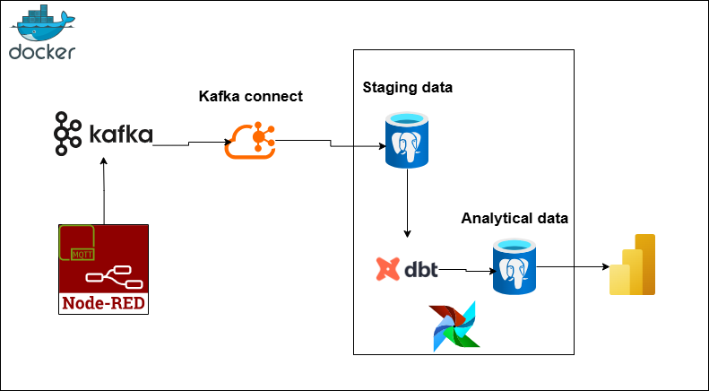
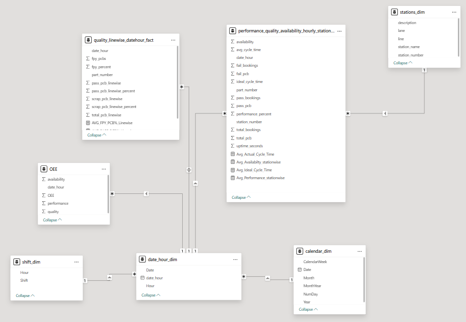
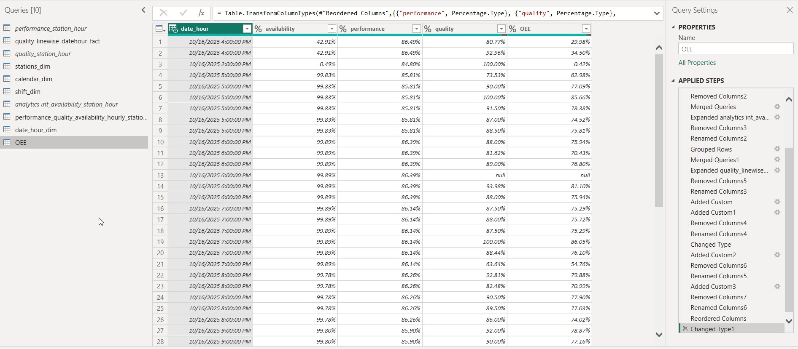
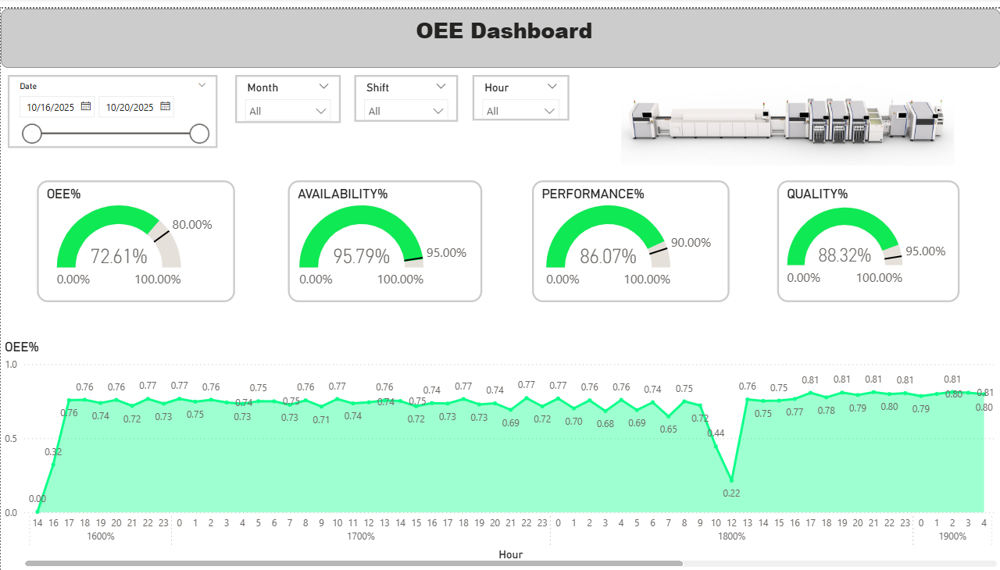
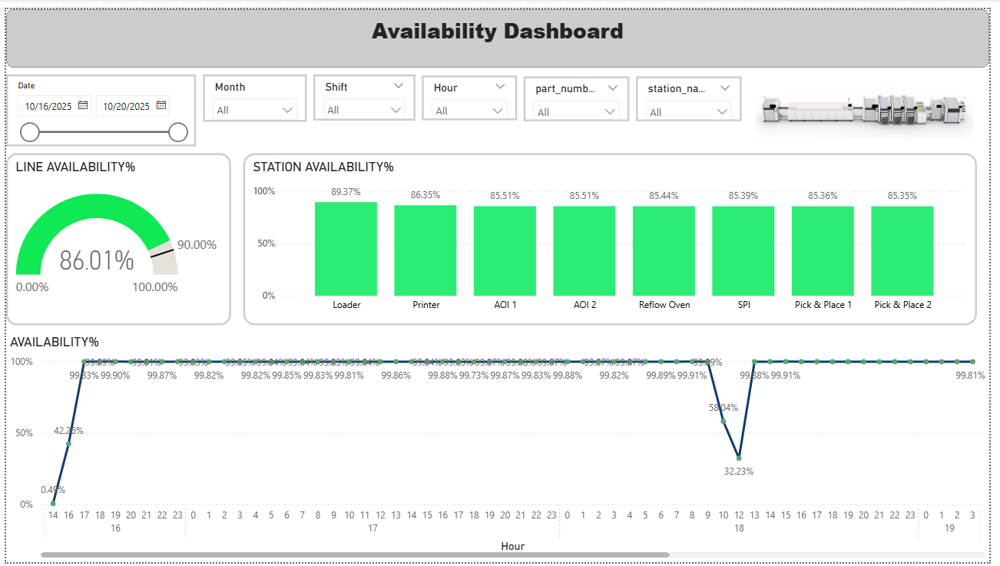
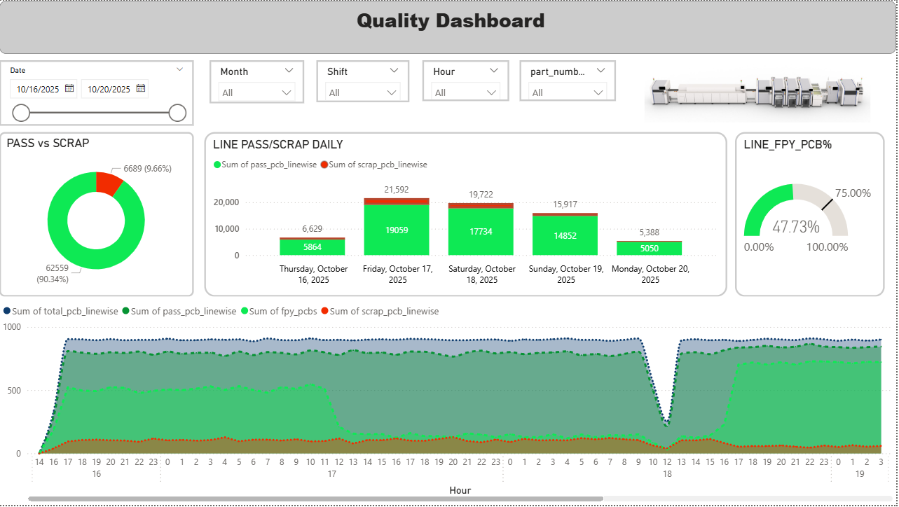
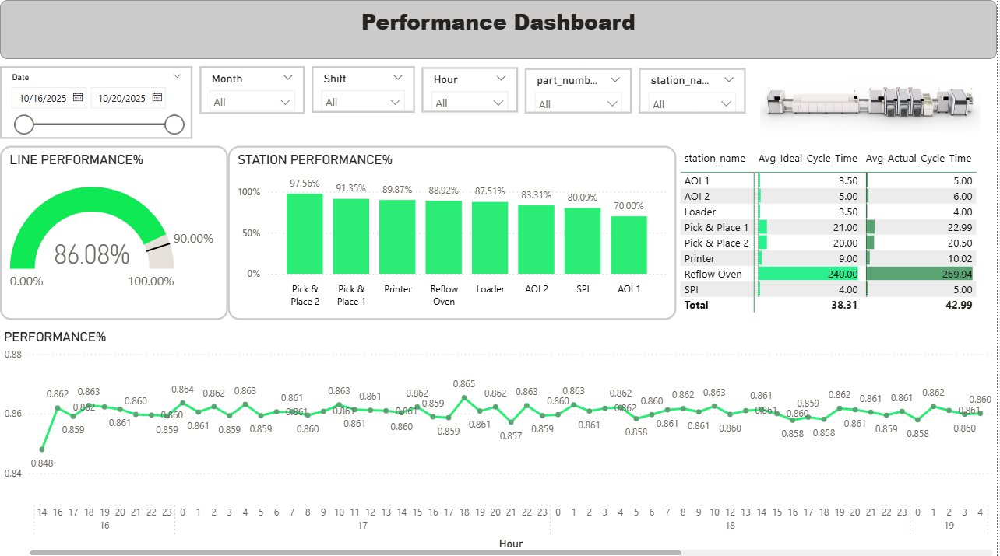

# 🧠 SMT Line Real-Time Data Pipeline  

### Node-RED → Kafka → PostgreSQL → Airflow + dbt → Power BI  

This project demonstrates a **real-time data engineering pipeline** for monitoring SMT (Surface Mount Technology) line performance.  
It collects production events from simulated sources, processes them through Kafka, stores them in PostgreSQL, transforms with dbt orchestrated by Airflow, and visualizes KPIs in Power BI.

---

## 🎯 1. Project Goal  

- Stream SMT station booking events (cycle times, pass/fail) in real-time.  
- Load data into a PostgreSQL staging schema using Kafka Connect.  
- Transform and model data for analytics using **dbt**.  
- Automate transformations with **Airflow DAGs**.  
- Visualize key performance KPIs in **Power BI**.

---

## 🧱 2. Architecture Overview  



**Flow Summary:**
1. **Node-RED** simulates SMT booking data.  
2. **Kafka** receives and streams events.  
3. **Kafka Connect** loads data into PostgreSQL (staging).  
4. **Airflow** orchestrates **dbt** transformations.  
5. **dbt** creates analytical models for Power BI visualization.  

---

## ⚙️ 3. Tools & Technologies  

| Layer | Tool | Purpose |
|-------|------|----------|
| Simulation | Node-RED | Event generator for production data |
| Streaming | Apache Kafka | Event transport layer |
| Integration | Kafka Connect | Sink to PostgreSQL |
| Database | PostgreSQL | Staging and analytical storage |
| Transformation | dbt Core | SQL-based modeling and KPIs |
| Orchestration | Apache Airflow | Scheduling and automation |
| Visualization | Power BI | Dashboard & KPI reports |
| Infrastructure | Docker Compose | Containerized environment |

---

## 📁 4. Project Structure  

```
.
├── airflow/
│   ├── start-airflow.sh
│   ├── dags/
│   │   └── dbt_hourly_refresh_dag.py
│   ├── logs
│   ├── plugins
│   ├── output
│     
│
├── dbt/
│   └── smt_project/
│       ├── models/
│       │   ├── intermediate/
│       │   │   ├── int_availability_station_hour.sql
│       │   │   └── int_performance_station_hour.sql
│       │   │   └── int_quality_linewise_datehour.sql
│       │   │   └── int_quality_station_hour.sql
│       │   │   └── intermediate_models.yml
│       │   └── staging/
v       │        ├── sources.yml
│       ├── seeds/
│       ├── profiles.yml
│       └── dbt_project.yml
│       └── dbt_project.yml
│       └── .user.yml
│
│
├── nodered-data/
│   └── flow.json
│
│
├── database/
│   ├── ini-db.sql
│   ├── postgres-data/
│    
│
├── kafka/
│   └── kafka-broker/
│   └── kafka-connect/
│         ├── deploy-connector.sh
│         ├── jdbc-sink-connector.json
│
│
├── mosquitto/
│   └── mosquittoconfig.conf
│   └── mosquitto-data/
│        
│
├── powerbi/
│   └── OEE.pbix
│   
│
├── docs/
│   └── architecture.png
│   └── OEE.png
│   └── quality.png
│   └── performance.png
│ 
│ 
├── docker-compose.yml
├── Dockerfile.kafka-connect_with_connectors
└── README.md
```

---

## 📊 5. Data Model & KPIs  

### 🧩 Staging Table  
**`public.station_records`**  
```
booking_id | serial_number | station_number | book_state | date_created | part_number | cycle_time | test_count
```

### ⚙️ Intermediate Models (dbt)

The intermediate layer aggregates and cleanses raw station-level data to prepare it for KPI reporting.  
Each model focuses on a specific aspect of production analytics — performance, availability, and quality.

| Model                               | Description                                                  | Key Outputs                                                  |
| ----------------------------------- | ------------------------------------------------------------ | ------------------------------------------------------------ |
| **`int_performance_station_hour`**  | Calculates hourly performance per station and part by comparing actual vs. ideal cycle times. | `avg_cycle_time`, `ideal_cycle_time`, `count_bookings`, `performance_percent` |
| **`int_availability_station_hour`** | Computes hourly equipment availability by measuring the active operational time (difference between consecutive bookings). | `available_time_sec`, `availability_percent`                 |
| **`int_quality_station_hour`**      | Aggregates hourly pass/fail statistics for each station and part, considering only the latest test result per serial number. | `total_pcb`, `fail_pcb`, `pass_pcb`, `total_bookings`, `fail_bookings`, `pass_bookings` |
| **`int_quality_linewise_datehour`** | Combines results from multiple stations to compute **line-level yield KPIs**, such as First Pass Yield (FPY) and scrap rates per part and hour. | `fpy_percent`, `pass_pcb_linewise_percent`, `scrap_pcb_linewise_percent`, `total_pcb_linewise` |

Together, these models form the **analytical foundation** for the Power BI dashboards, allowing users to explore hourly station and line performance, availability, and quality trends.  

### 🎨 Power BI Data Modeling & Transformations

The Power BI layer serves as the visualization and KPI computation engine for the analytical data coming from PostgreSQL (via dbt models).

#### 🧱 Data Model Overview



The data model connects dimension and fact tables to enable drill-down and time-based analysis across OEE metrics. Unified star-schema model for efficient OEE computation.

| Table | Type | Description |
|--------|------|--------------|
| **date_hour_dim** | Dimension | Represents hourly time granularity. |
| **calendar_dim** | Dimension | Calendar view for aggregating data daily/monthly. |
| **shift_dim** | Dimension | Shift-related grouping (Morning, Evening, Night). |
| **stations_dim** | Dimension | Machine/station metadata (station number, name, line). |
| **performance_quality_availability_hourly_fact** | Fact | Main analytical table containing hourly KPIs for each station. |
| **quality_linewise_datehour_fact** | Fact | Aggregated line-level FPY and scrap rates per hour. |
| **OEE** | Calculated Table | Derived in Power BI using measures for Availability × Performance × Quality. |

### ⚙️ Data Transformations in Power BI



Key transformations performed in **Power Query Editor** include:
1. **Merging Queries:** Combined multiple dbt models (`performance`, `availability`, `quality`) into one fact table.
2. **Grouping & Aggregation:** Computed total uptime, average cycle time, and pass/fail counts.
3. **DAX Measures:**
   ```DAX
   OEE% = [Availability%] * [Performance%] * [Quality%]
   FPY% = [Pass_PCB_Linewise] / [Total_PCB_Linewise]
   ```
4. **Normalization:** Adjusted timestamp columns and ensured numeric consistency.

---

#### 📊 Dashboards

##### OEE Dashboard


##### Availability Dashboard


##### Quality Dashboard


##### Performance Dashboard



---

## 🧰 6. How to Run the Project  

### 🔹 Step 1: Requirements  
- Docker Desktop or Docker Engine  
- Power BI Desktop (for dashboard visualization)

---

### 🔹 Step 2: Launch Containers  
Run all services (Kafka, PostgreSQL, Airflow, Node-RED, dbt) together:

```bash
docker compose up -d --build
```

**Main Services:**
| Service | URL / Port | Description |
|----------|-------------|--------------|
| Node-RED | [http://localhost:1880](http://localhost:1880) | Data generator |
| Kafka Broker | localhost:9092 | Message broker |
| Kafka Connect | [http://localhost:8083](http://localhost:8083) | Data ingestion service |
| PostgreSQL | localhost:5434 | Staging and analytics DB |
| Airflow Webserver | [http://localhost:8080](http://localhost:8080) | DAG orchestration |
| Power BI | — | Visualization frontend |

---

### 🔹 Step 3: Node-RED Data Simulation  
1. Open Node-RED → **Import** → `nodered/flow.json`  
2. Deploy → Data starts streaming to Kafka topic `station_events`

---

### 🔹 Step 4: Verify Kafka → PostgreSQL  
Kafka Connect automatically writes to:  
```
public.station_records
```
You can check via psql:
```sql
SELECT COUNT(*) FROM public.station_records;
```

---

### 🔹 Step 5: Run dbt Models  

```bash
cd dbt/smt_project
dbt deps
dbt build
```

To update only incrementally:
```bash
dbt run --select int_performance_station_hour
```

---

### 🔹 Step 6: Schedule with Airflow  
1. Open Airflow UI → [http://localhost:8080](http://localhost:8080)  
2. Login: `admin / admin`  
3. Enable DAG `dbt_hourly_refresh`  
4. Trigger manually or wait for the next hourly run.

---

### 🔹 Step 7: Visualize in Power BI  
1. Open `powerbi/dashboard.pbix`  
2. Connect to PostgreSQL  
   - **Server:** `localhost`  
   - **Database:** `smt`  
   - **User:** `smtadmin`  
   - **Password:** `110113`  
3. Select analytical models (`int_performance_station_hour`, `int_availability_station_hour`)  
4. Click **Refresh** to load latest data.

---

## 🧩 8. Troubleshooting  

| Issue | Solution |
|--------|-----------|
| `Permission denied /dbt_project/target` | `chmod -R 777 dbt/smt_project/target` |
| Airflow DAG fails | Ensure dbt container can access Postgres |
| Power BI “Exception while reading from stream” | Verify PostgreSQL is reachable (localhost:5434) |
| Kafka Connect not writing | Check topic and connector status at `http://localhost:8083/connectors` |
| Airflow log permission error | `chmod -R 777 airflow/logs` |

---

## 🧭 9. Stop or Clean Up  

```bash
docker compose down
```

To remove all persisted data:
```bash
docker compose down -v
```

---

## 👤 10. Author  

**Ali Ostadi**  
Master’s Student – Information System    
📧 ali.ostadiy@gmail.com  
🔗 [LinkedIn](https://www.linkedin.com/in/aliostadi/)

---

## 🪶 11. License  

This project is for educational and academic purposes only.  
All icons and product logos are property of their respective owners.

---

## ✅ Summary  

✔️ **One-command deployment:** `docker compose up -d`  
✔️ **Pipeline:** Node-RED → Kafka → PostgreSQL → Airflow/dbt → Power BI  
✔️ **Purpose:** Real-time KPI monitoring for SMT line performance and availability.
